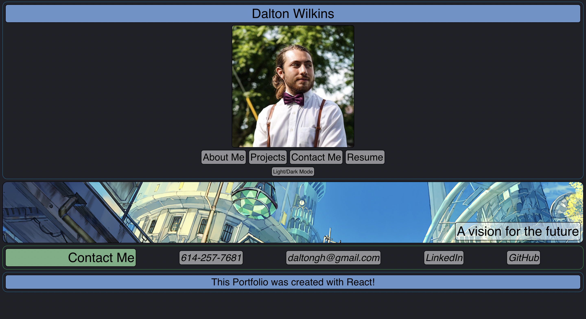

# React Portfolio

## Table of Contents
[Project Link](#Link)  
[Technologies](#Technologies)  
[Description](#Description)  
[Screenshots](#Screenshots)  
[License](#License)  
[Contact](#Contact)

## Link
https://dalto135.github.io/react-portfolio/

## Technologies
HTML and CSS, Javascript, React

## Description
A portfolio website designed to both provide my personal information and demonstrate various skills using HTML, CSS and React. For the displayed work, I have included various projects I have created that demonstrate various skills. Links to the deployed apps and github sites are available in this section. Site theme can be toggled between light and dark mode.

## Screenshots

## License
MIT

## Contact
Dalton Wilkins - daltongh@gmail.com
